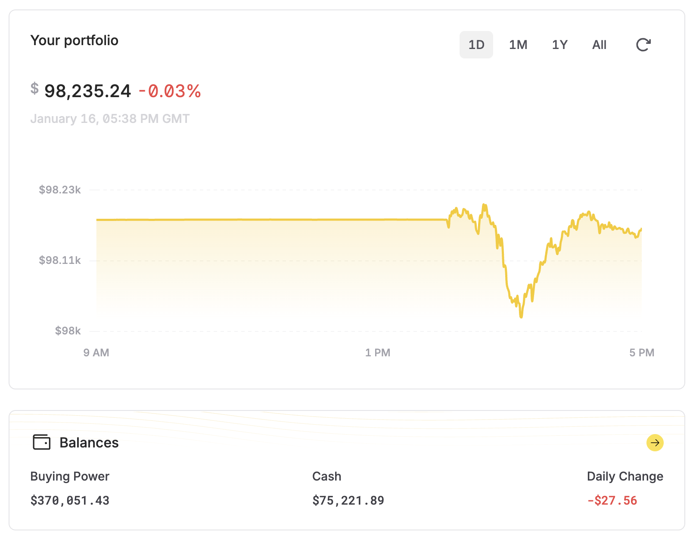

# LFT - Low Frequency Trader

A fully automated C++23 multi-strategy trading system for US equities, built on Alpaca Markets API.



## Features

### Multi-Strategy Framework
- 6 concurrent trading strategies evaluated every minute
- Automatic calibration on 30 days of historic data with realistic spread simulation
- Only enables profitable strategies based on backtest results
- Per-strategy performance tracking with win rate and P&L metrics
- API-based state management (no local files required)
- Strategy parameters encoded in every order for full traceability

### Trading Strategies
1. **Dip Buying** - Entry on 2% price drops
2. **MA Crossover** - 5-period crosses 20-period moving average
3. **Mean Reversion** - Price >2 standard deviations below MA
4. **Volatility Breakout** - Expansion from compression with volume
5. **Relative Strength** - Outperformance vs market basket by >0.5%
6. **Volume Surge** - 2x average volume with upward momentum >0.5%

### Automated Risk Management
- **Adaptive TP/SL:** Widens targets in volatile conditions (3:1 signal-to-noise ratio)
- **Volume confidence filtering:** Reduces signal confidence in low-volume periods
- **Noise regime detection:** Disables momentum strategies in high noise (>1.5%), disables mean reversion in low noise (<0.5%)
- **Base exit parameters:** 2% TP/SL, 0.5% trailing stop (adaptive based on market conditions)
- **Spread filtering:** Blocks trades with excessive bid-ask spreads (30 bps for stocks)
- **End-of-day liquidation:** Auto-closes all equity positions at 3:55 PM ET to avoid overnight risk
- **Duplicate order prevention:** Checks both open positions and pending orders before placing new trades

### Fully Automated Operation
- **Restart recovery:** Rebuilds state from Alpaca API after restarts
- **Pending order tracking:** Prevents duplicate orders during 1-minute polling cycle
- **Intraday equity trading:** Closes all stock positions before market close (3:55 PM ET)
- **No manual intervention required**

## Quick Start

```bash
# Configure API credentials
cp .env.example .env
# Edit .env with your Alpaca API keys

# Build and run (includes automatic calibration)
source .env
make run
```

## Tech Stack

- **Language:** C++23 (std::expected, std::ranges, std::println)
- **API:** Alpaca Markets (paper and live trading)
- **Build:** CMake + Make
- **Dependencies:** cpp-httplib, nlohmann/json (via FetchContent)
- **State Management:** Alpaca API (client_order_id field stores all trade parameters)

## Project Structure

```
src/
  lft.cxx           - Main trading loop with auto-calibration
  alpaca_client.cxx - Alpaca API integration (market data, orders, positions)
  strategies.cxx    - Six trading strategy implementations
include/
  defs.h            - Trading constants and compile-time validation
  alpaca_client.h   - API client interface
  strategies.h      - Strategy interfaces and data structures
  exit_logic_tests.h - Compile-time exit logic verification
scripts/
  fetch_orders.sh   - Export order history to CSV for analysis
```

## Utility Scripts

### Fetch Order History
```bash
# View recent orders in terminal
./scripts/fetch_orders.sh

# Export to CSV for analysis
./scripts/fetch_orders.sh --csv my_orders.csv
```

Fetches last 7 days of orders (up to 500) with full details including strategy parameters encoded in `client_order_id`.

## Architecture Decisions

### State Management via Alpaca API
All trade state is stored in Alpaca's API rather than local files:
- **Strategy parameters** encoded in `client_order_id` field: `"strategy_name|tp:2.0|sl:-5.0|ts:0.5"`
- **Position recovery** on restart by querying open positions and matching to order history
- **No CSV parsing** required for state reconstruction
- **Single source of truth** prevents state inconsistencies

### Duplicate Order Prevention
The system tracks `symbols_in_use` by combining:
1. Open positions from `/v2/positions`
2. Pending orders from `/v2/orders?status=open`

This prevents the race condition where orders placed during the 1-minute polling cycle would create duplicate positions (observed: 73 DOGE orders in one session before fix).

### Market Hours & EOD Liquidation
- Trades US equities during regular hours (9:30 AM - 4:00 PM ET)
- Auto-closes all equity positions at 3:55 PM ET
- Crypto trades 24/7 (not affected by EOD liquidation)
- Uses DST-aware time conversion (EDT/EST detection)

## Performance Observations

From historical analysis of 500 orders over 7 days:
- **Most traded:** DOGE/USD (73 orders), LINK/USD (49), SOL/USD (46)
- **Duplicate bug impact:** ~30% of trades were duplicates before pending order check
- **Strategy encoding:** Implemented Jan 12, 2026 (only latest orders have encoding)

## Development Roadmap

- [x] Phase 1: Manual trading with Alpaca API integration
- [x] Phase 2: Backtesting framework with historic data
- [x] Phase 3: Automated trading with duplicate prevention
- [x] Phase 4: EOD liquidation and automated operation
- [ ] Phase 5: Real-time monitoring dashboard (web UI)
- [ ] Phase 6: Production deployment to VPS

## Cryptocurrency Trading

**Status:** Temporarily removed (2026-01-16)

Cryptocurrency trading has been removed from the codebase to simplify development and eliminate code duplication. Reasons:

1. All crypto pairs were disabled due to duplicate order bug discovered 2026-01-13
2. Crypto trading loop was 200+ lines of duplicated code from stock loop
3. Removing dead code improves maintainability

**To re-enable crypto trading:**

- Fix the duplicate order bug root cause
- Restore crypto code from git history (commit hash before 2026-01-16)
- Consider refactoring to share entry logic between stocks and crypto
- Re-test thoroughly with duplicate prevention

The `crypto` vector in [include/defs.h](include/defs.h) remains (commented out) as documentation of previously supported pairs.

## Known Issues

See [GitHub Issues](https://github.com/deanturpin/lft/issues) for active development:
- [#30](https://github.com/deanturpin/lft/issues/30) WebSocket support for real-time updates (future enhancement)
- [#31](https://github.com/deanturpin/lft/issues/31) Portfolio history export script

## Trading Performance

Run `./scripts/fetch_orders.sh --csv` to analyze your trading history. The CSV includes:
- Order timestamps and symbols
- Buy/sell side with quantities and notional amounts
- Fill status
- Strategy parameters (for orders placed after Jan 12, 2026)

All historical data available via Alpaca API for post-trade analysis.
