# LFT - Low Frequency Trader

A fully automated C++23 multi-strategy trading system for US equities, built on Alpaca Markets API.


## Features

### Multi-Strategy Framework

- 6 concurrent trading strategies evaluated every minute
- Automatic calibration on 30 days of historic data with realistic spread simulation
- Only enables profitable strategies based on backtest results
- Per-strategy performance tracking with win rate and P&L metrics
- API-based state management (no local files required)
- Strategy parameters encoded in every order for full traceability

### Trading Strategies

1. **Dip Buying** - Entry on 2% price drops
2. **MA Crossover** - 5-period crosses 20-period moving average
3. **Mean Reversion** - Price >2 standard deviations below MA
4. **Volatility Breakout** - Expansion from compression with volume
5. **Relative Strength** - Outperformance vs market basket by >0.5%
6. **Volume Surge** - 2x average volume with upward momentum >0.5%

### Automated Risk Management

- **Adaptive TP/SL:** Widens targets in volatile conditions (3:1 signal-to-noise ratio)
- **Volume confidence filtering:** Reduces signal confidence in low-volume periods
- **Noise regime detection:** Disables momentum strategies in high noise (>1.5%), disables mean reversion in low noise (<0.5%)
- **Base exit parameters:** 2% TP/SL, 0.5% trailing stop (adaptive based on market conditions)
- **Spread filtering:** Blocks trades with excessive bid-ask spreads (30 bps for stocks)
- **End-of-day liquidation:** Auto-closes all equity positions at 3:55 PM ET to avoid overnight risk
- **Duplicate order prevention:** Checks both open positions and pending orders before placing new trades

### Fully Automated Operation

- **Restart recovery:** Rebuilds state from Alpaca API after restarts
- **Pending order tracking:** Prevents duplicate orders during 1-minute polling cycle
- **Intraday equity trading:** Closes all stock positions before market close (3:55 PM ET)
- **No manual intervention required**

## Trading Cycle Architecture

```mermaid
gantt
    title LFT Trading Cycles
    dateFormat HH:mm
    axisFormat %H:%M

    section Market Hours
    Market Open (9:30 ET)           :milestone, 09:30, 0m
    Breakfast Breakout Window       :active, 09:30, 30m
    Normal Trading                  :active, 10:00, 5h30m
    No More Entries (3:30 ET)       :milestone, 15:30, 0m
    Force Flat Window               :crit, 15:30, 20m
    Market Close (4:00 ET)          :milestone, 16:00, 0m

    section 1-Minute Cycle
    Panic Checks (every :35)        :done, 09:35, 6h25m
    Force Flat Liquidation          :crit, 15:50, 10m
    Panic Stop Loss (6%)            :done, 09:35, 6h25m
    EOD Cutoff Check (3:50 ET)      :crit, 15:50, 10m

    section 15-Minute Cycle
    Normal Entry Signals            :active, 09:45, 5h45m
    Normal Exits (TP/SL/Trailing)   :active, 09:45, 5h45m

    section 60-Minute Cycle
    Re-calibration (every hour)     :done, 10:00, 6h
```



### Timing Breakdown

#### 1-Minute Bar (Panic Cycle)

Runs every minute at :35 seconds

- Force flat liquidation (EOD cutoff: 3:50 PM ET)
- Panic stop loss (6% catastrophic loss)
- Risk-off state check (future feature)

#### 15-Minute Bar (Strategy Cycle)

Runs at :00, :15, :30, :45

- Normal entry signals (all strategies)
- Normal exits (TP: 100%, SL: 3%, Trailing: 2%)

#### 60-Minute Bar (Calibration Cycle)

Runs at whole hour

- Strategy recalibration on 30 days of historic data
- Enable/disable strategies based on profitability

#### Key Times (Eastern Time)

- **9:30 AM** - Market open, breakfast breakout opportunities
- **3:30 PM** - No more new entries allowed
- **3:50 PM** - Force flat: panic cycle liquidates all positions
- **4:00 PM** - Market close

## Quick Start

### Prerequisites

- CMake 3.25+
- C++23 compatible compiler (GCC 13+, Clang 16+, or Apple Clang 15+)
- Internet connection (for FetchContent to download dependencies)
- Alpaca Markets API keys ([sign up free](https://app.alpaca.markets/signup))

### Build and Run

```bash
# Configure API credentials
cp .env.example .env
# Edit .env with your Alpaca API keys

# Build and run (includes automatic calibration)
source .env
make run
```

### What You Should See

#### Phase 1: Calibration

```text
🚀 LFT - Low Frequency Trader V2
📊 Fetching historical data...
🎯 Calibrating strategies with $100000.00 starting capital...

  Using starting capital: $100000.00

  🔧 Testing ma_crossover...
     ✓ Complete - 45 trades, $234.56 P&L
  🔧 Testing mean_reversion...
     ✓ Complete - 67 trades, $456.78 P&L
  ...

📊 Calibration complete:

  Exit Criteria:
    Take Profit:  100.0%
    Stop Loss:    3.0%
    Panic Stop:   6.0%
    Trailing:     2.0%

  ma_crossover         ENABLED  P&L=$  234.56 WR= 56.2%
  mean_reversion       ENABLED  P&L=$  456.78 WR= 61.3%
  ...

  3 of 5 strategies enabled for live trading
```

#### Phase 2: Live Trading

```text
🔄 Starting event loop until 11:00:00

10:00:35 | Session ends: 11:00:00 | Remaining: 59 min

⏰ Next Events:
  Strategy Cycle:  10:15:00  (entries + TP/SL/trailing)
  Panic Check:     10:01:35  (panic stops + EOD liquidation)

💰 Account Summary:
  Cash:       $95,123.45
  Equity:     $99,876.54
  Positions:  4
  ...
```

If a strategy fires, you'll see:

```text
🚨 SIGNAL: AAPL - mean_reversion (Price -2.3σ below MA)
   Placing order for $1000.00...
✅ Order placed: ID=abc123 status=filled side=buy notional=$1000
```

### Troubleshooting

#### "ALPACA_API_KEY and ALPACA_API_SECRET must be set"

- Make sure you ran `source .env`

#### Network errors

- Check your internet connection
- Verify API keys are correct
- Ensure you're using paper trading URL

#### Compilation errors

- Check C++23 support: `g++ --version` or `clang++ --version`
- Make sure CMake is 3.25+: `cmake --version`

## Tech Stack

- **Language:** C++23 (std::expected, std::ranges, std::println)
- **API:** Alpaca Markets (paper and live trading)
- **Build:** CMake + Make
- **Dependencies:** cpp-httplib, nlohmann/json (via FetchContent)
- **State Management:** Alpaca API (client_order_id field stores all trade parameters)

## Project Structure

```text
src/
  lft.cxx           - Main trading loop with auto-calibration
  alpaca_client.cxx - Alpaca API integration (market data, orders, positions)
  strategies.cxx    - Six trading strategy implementations
include/
  defs.h            - Trading constants and compile-time validation
  alpaca_client.h   - API client interface
  strategies.h      - Strategy interfaces and data structures
  exit_logic_tests.h - Compile-time exit logic verification
bin/
  fetch_orders.sh   - Export order history to CSV for analysis
```

## Utility Scripts

### Fetch Order History

```bash
# View recent orders in terminal
bin/fetch_orders.sh

# Export to CSV for analysis
bin/fetch_orders.sh --csv my_orders.csv
```

Fetches last 7 days of orders (up to 500) with full details including strategy parameters encoded in `client_order_id`.

## Architecture Decisions

### Serial (Single-Threaded) Architecture

The system uses a **clean serial architecture** instead of multi-threading:

- Single event loop in [src/main.cxx](src/main.cxx) handles all phases sequentially
- No mutex/semaphore complexity or race conditions
- Simpler to debug and maintain
- Market data updates are infrequent (15-minute bars), making parallelism unnecessary
- `thread_poc.cxx` remains in codebase as reference for potential future optimisation

This architectural decision prioritises correctness and maintainability over theoretical performance gains that aren't needed for the current use case.

### State Management via Alpaca API

All trade state is stored in Alpaca's API rather than local files:

- **Strategy parameters** encoded in `client_order_id` field: `"strategy_name|tp:2.0|sl:-5.0|ts:0.5"`
- **Position recovery** on restart by querying open positions and matching to order history
- **No CSV parsing** required for state reconstruction
- **Single source of truth** prevents state inconsistencies

### Duplicate Order Prevention

The system tracks `symbols_in_use` by combining:

1. Open positions from `/v2/positions`
2. Pending orders from `/v2/orders?status=open`

This prevents the race condition where orders placed during the 1-minute polling cycle would create duplicate positions (observed: 73 DOGE orders in one session before fix).

### Market Hours & EOD Liquidation

- Trades US equities during regular hours (9:30 AM - 4:00 PM ET)
- Auto-closes all equity positions at 3:55 PM ET
- Crypto trades 24/7 (not affected by EOD liquidation)
- Uses DST-aware time conversion (EDT/EST detection)

## Performance Observations

From historical analysis of 500 orders over 7 days:

- **Most traded:** DOGE/USD (73 orders), LINK/USD (49), SOL/USD (46)
- **Duplicate bug impact:** ~30% of trades were duplicates before pending order check
- **Strategy encoding:** Implemented Jan 12, 2026 (only latest orders have encoding)

## Development Roadmap

- [x] Phase 1: Manual trading with Alpaca API integration
- [x] Phase 2: Backtesting framework with historic data
- [x] Phase 3: Automated trading with duplicate prevention
- [x] Phase 4: EOD liquidation and automated operation
- [x] Phase 5: Production deployment to VPS (Fasthosts)
- [ ] Phase 6: Real-time monitoring dashboard (web UI)

## Cryptocurrency Trading

**Status:** Temporarily removed (2026-01-16)

Cryptocurrency trading has been removed from the codebase to simplify development and eliminate code duplication. Reasons:

1. All crypto pairs were disabled due to duplicate order bug discovered 2026-01-13
2. Crypto trading loop was 200+ lines of duplicated code from stock loop
3. Removing dead code improves maintainability

**To re-enable crypto trading:**

- Fix the duplicate order bug root cause
- Restore crypto code from git history (commit hash before 2026-01-16)
- Consider refactoring to share entry logic between stocks and crypto
- Re-test thoroughly with duplicate prevention

The `crypto` vector in [include/defs.h](include/defs.h) remains (commented out) as documentation of previously supported pairs.

## Known Issues

See [GitHub Issues](https://github.com/deanturpin/lft/issues) for active development:

- [#30](https://github.com/deanturpin/lft/issues/30) WebSocket support for real-time updates (future enhancement)
- [#31](https://github.com/deanturpin/lft/issues/31) Portfolio history export script

## Testing

**Compile-Time Tests** (~160 assertions via `static_assert`):

- Parameter validation ([include/defs.h](include/defs.h))
- Exit logic calculations ([include/exit_criteria.h](include/exit_criteria.h))
- Helper function correctness

**Runtime Tests**: Currently being redesigned (see [#72](https://github.com/deanturpin/lft/issues/72))

**Philosophy**: Test business logic without external dependencies. Integration testing happens in paper trading mode.

## Trading Performance

Run `bin/fetch_orders.sh --csv` to analyze your trading history. The CSV includes:

- Order timestamps and symbols
- Buy/sell side with quantities and notional amounts
- Fill status
- Strategy parameters (for orders placed after Jan 12, 2026)

All historical data available via Alpaca API for post-trade analysis.

## Project Metrics

**Source Lines of Code**: 3,261 (86% C++, 14% C headers)

**Development Effort** (COCOMO model):

- Estimated: 8.3 person-months (~$223k at 2026 market rates)
- Actual: ~1 month with Claude Code assistance
- ROI: ~97% reduction in development time

Generated using [SLOCCount](https://dwheeler.com/sloccount/).
